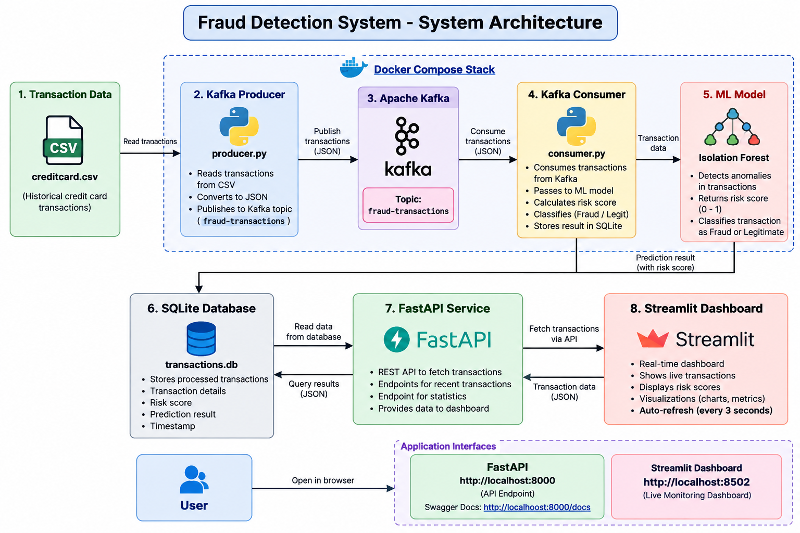

# Real-Time Fraud Detection System

A real-time transaction fraud detection system built using Kafka, Isolation Forest, FastAPI, SQLite and Streamlit.

The system receives transaction data through a Kafka stream, analyzes transactions using an Isolation Forest anomaly detection model, calculates a risk score, stores the results in SQLite and visualizes them through a real-time Streamlit dashboard.

## Features

- Real-time transaction streaming using Apache Kafka
- Machine learning based anomaly detection
- Isolation Forest fraud detection model
- Risk scoring from 0 to 100
- Automatic transaction classification
- SQLite transaction storage
- FastAPI backend
- Real-time Streamlit dashboard
- Automatic dashboard refresh
- Model evaluation using precision, recall and F1-score

## System Architecture



## Tech Stack

| Component | Technology |
|---|---|
| Programming Language | Python |
| Machine Learning | Scikit-learn |
| Anomaly Detection | Isolation Forest |
| Streaming | Apache Kafka |
| Backend | FastAPI |
| Database | SQLite |
| Dashboard | Streamlit |
| Data Processing | Pandas, NumPy |
| Containerization | Docker, Docker Compose |

## Project Structure

```text
FraudDetectionSystem/
│
├── api/
│   └── main.py
│
├── database/
│   └── database.py
│
├── generator/
│   └── transaction_generator.py
│
├── model/
│   ├── train.py
│   ├── predict.py
│   ├── evaluate.py
│   └── fraud_model.pkl
│
├── streaming/
│   ├── producer.py
│   └── consumer.py
│
├── dashboard.py
├── check_data.py
├── Dockerfile
├── docker-compose.yml
├── requirements.txt
├── architecture.png
└── README.md
```

## Dataset

The project uses the Credit Card Fraud Detection dataset from Kaggle.

The dataset is not included in this repository. Download `creditcard.csv` and place it at:

```text
data/creditcard.csv
```

## Demo

The complete system can be run locally using Docker Compose.

The application includes Kafka-based transaction streaming, real-time anomaly detection, SQLite persistence, a FastAPI backend, and a Streamlit monitoring dashboard.

### Requirements

- Python 3.11+
- Docker Desktop
- Git
- Credit Card Fraud Detection dataset

Python dependencies can be installed with:

```bash
pip install -r requirements.txt
```
Public cloud deployment is planned for a future version.
